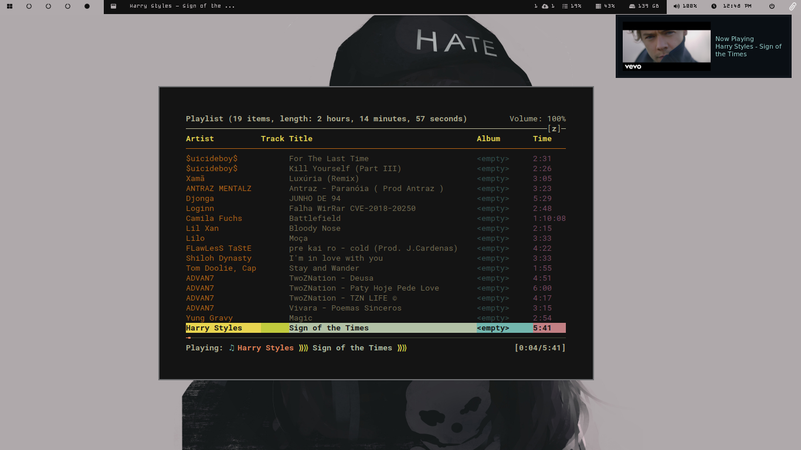
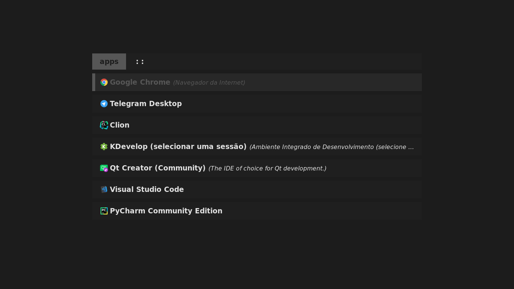
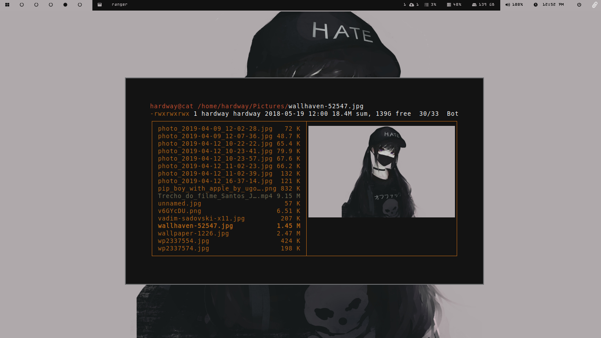

# 

## Screenshot
# 
# 
# 
# 

## Wallpaper

# warning
 > To use this configuration you just need to have installed rofi, awesome font, bdf-bitocra, font Mononoki and monofur font.
 > For you who uses Arch linux, you must have installed yay and pacman-contrib for update script.
 >
